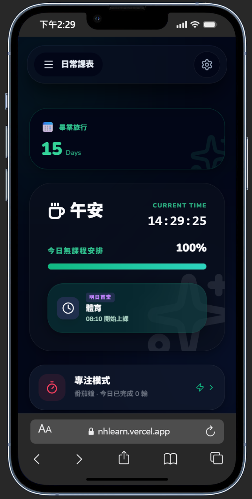
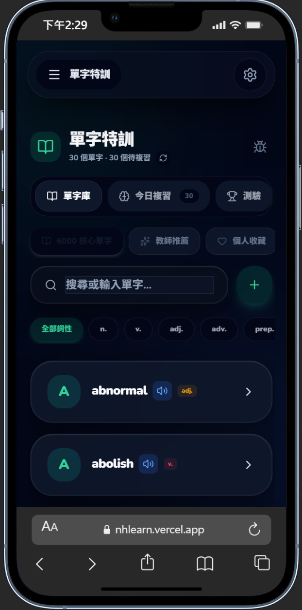
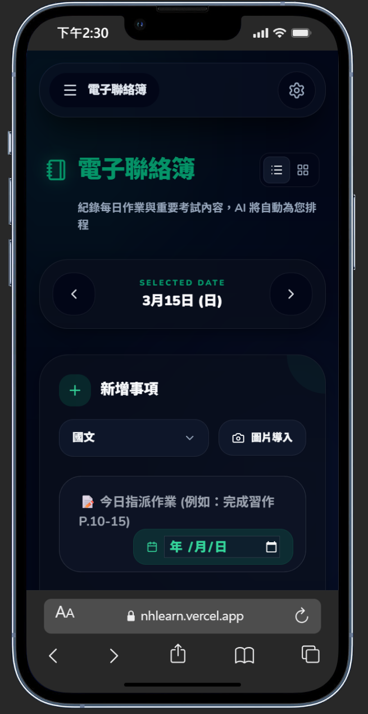
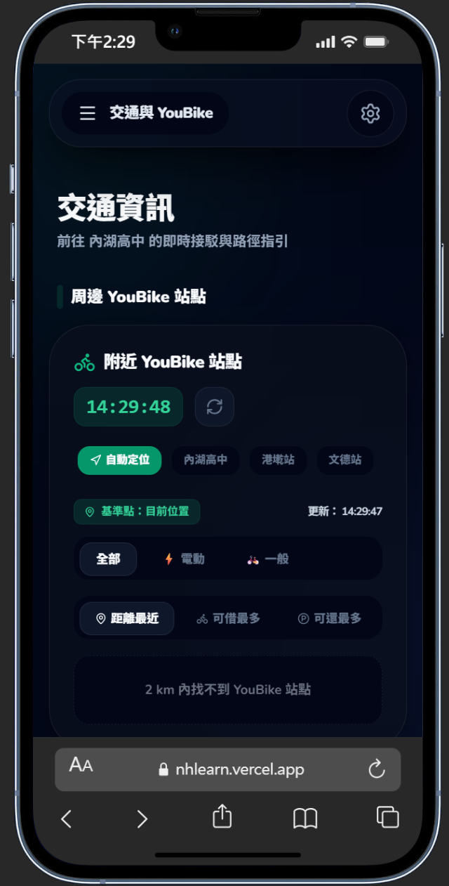

<div align="center">

# 🎓 GSAT Pro | 學測數位神助手

**專為台灣高中生打造的頂級數位學習與班級管理助理**

[](https://reactjs.org/)
[](https://tailwindcss.com/)
[](https://firebase.google.com/)
[](https://aistudio.google.com/)

[線上體驗 (Live Demo)](#) • [功能介紹](#核心功能-sparkles) • [安裝指南](#本地開發與部署-wrench)

</div>

---

## 🌟 關於專案 (About)

**GSAT Pro** 是一款具備 Apple iOS 原生級操作手感（Liquid Glass 液態玻璃設計、Cubic-bezier 阻尼動畫）的 Progressive Web App (PWA)。

它不僅結合了 **Google Gemini 2.5 flash** 強大的影像辨識與語意分析能力，更深度整合了 **Firebase** 雲端即時同步技術。從「AI 自動解析課表」、「單字記憶曲線 (SRS) 特訓」、「班級聯絡簿雲端同步」到「校園周邊 YouBike 即時動態」，全方位解決高中生在學測備考期間的痛點。

---

## 📸 畫面預覽 (Screenshots)

> **💡 提示：** 建議在此處放入實際的 App 截圖或 GIF 動畫
> 
> <div align="center">
>   
>   
>   
>   
> </div>

---

## 🔥 核心功能 (Features)

### 🤖 AI 智慧驅動 (Powered by Gemini)
*   **AI 課表/聯絡簿解析：** 隨手拍下黑板照片，AI 自動萃取科目、作業、考試內容與時間，一鍵匯入系統。
*   **AI 單字深度解析：** 自動補齊單字詞性、中文解釋，並生成「學測必考搭配詞」、「情境例句」與「易混淆字」。
*   **AI 動態測驗生成：** 根據你收藏的單字或筆記，瞬間生成「AI 文法題」與「克漏字 (Cloze) 情境測驗」。

### 🧠 單字特訓與記憶曲線 (SRS)
*   **科學複習：** 內建 6000 單字庫，根據使用者的作答回饋（秒答 / 模糊 / 忘了），系統自動排程最佳的複習日期。
*   **3D 翻轉閃卡：** 結合精緻的 3D 翻轉動畫與真人發音，提供沉浸式背誦體驗。
*   **IG 限動分享：** 獨家 Canvas 繪圖引擎，一鍵將單字解析生成高質感的 9:16 玻璃風圖片，並附帶專屬 QR Code 下載連結，輕鬆分享至 Instagram。

### 🏫 班級雲端同步 (Classroom Sync)
*   **電子聯絡簿：** 綁定「班級代碼」後，全班共享考試與作業清單。
*   **已讀確認系統：** 內建「確認收到」按讚功能，小老師輕鬆掌握同學閱讀狀況。
*   **即時推播通知 (FCM)：** 課程異動、明日考試提醒，透過 Service Worker 即時推播至手機鎖定畫面。

### 🧭 交通與校園生活 (Campus Life)
*   **天氣預報與倒數：** 根據早中晚自動變換首頁漸層，自訂專屬目標倒數（支援霓虹、櫻花粉等主題）。
*   **YouBike 2.0 整合：** 透過政府 Open Data API 即時抓取周邊車輛，支援「走路可達」標示與「星號置頂收藏」。
*   **一鍵導航與叫車：** 內建 Uber Deep Link（直接帶入學校精準座標）與公車動態跳轉功能。

### 🎨 頂級工藝體驗 (Premium UI/UX)
*   **Liquid Glass 液態玻璃：** 全面採用高飽和度毛玻璃 (`backdrop-blur` & `saturate`)。
*   **Command Palette：** 支援鍵盤快捷鍵 `CMD/CTRL + K`，快速全域搜尋與導航。
*   **Apple 級流暢過渡：** 採用 `View Transitions API` 達成完美的深/淺色主題無縫溶解切換。

---

## 🛠️ 技術棧 (Tech Stack)

*   **前端框架：** React 18 (Vite)
*   **樣式與動畫：** Tailwind CSS, CSS Keyframes (`cubic-bezier` 阻尼動畫)
*   **雲端後端 (BaaS)：** Firebase (Authentication, Firestore, Cloud Messaging, Hosting)
*   **圖示庫：** Lucide React
*   **AI 引擎：** Google Gemini 2.5 Flash API
*   **資料處理：** SheetJS (XLSX 解析), React Markdown
*   **外部 API：** YouBike 2.0 Open Data, Open-Meteo API (天氣)


---

## 📂 專案目錄結構 (Project Structure)

本專案採用 React + Vite 作為前端框架，並結合 Firebase 作為後端服務。以下為核心目錄與檔案結構說明：

```text
gsat-pro/
├── public/
│   ├── firebase-messaging-sw.js  # Firebase FCM 雲端推播 Service Worker
│   └── ...                       # 其他靜態資源 (如 PWA Icons, Manifest)
├── src/
│   ├── components/               # React UI 元件庫
│   │   ├── tabs/                 # 主應用程式功能分頁 (Tabs)
│   │   │   ├── VocabularyTab.jsx # 單字特訓模組 (單字庫、今日複習、測驗、AI 匯入)
│   │   │   └── ...               # 其他模組分頁
│   │   └── ...                   # 其他共用元件 (如 Notifications, Modals)
│   ├── config/                   # 系統與後端設定檔
│   │   └── firebase.js           # Firebase 服務初始化 (Auth, Firestore, Messaging)
│   ├── utils/                    # 共用輔助函式庫
│   │   └── helpers.js            # 共用邏輯 (如 fetchAI Gemini API 呼叫、時間格式化)
│   ├── App.jsx                   # 主應用程式進入點 (版面佈局、狀態管理)
│   ├── main.jsx                  # React 應用程式掛載點
│   └── index.css                 # 全域樣式設定 (包含 Tailwind 指令與自訂動畫 CSS)
├── .env                          # 環境變數檔 (存放 Gemini API Key, Firebase Config)
├── index.html                    # 網頁入口 HTML 模板
├── package.json                  # Node.js 專案相依套件與腳本設定
├── tailwind.config.js            # Tailwind CSS 主題、擴充顏色與自訂動畫設定
└── vite.config.js                # Vite 打包與開發伺服器建置設定


